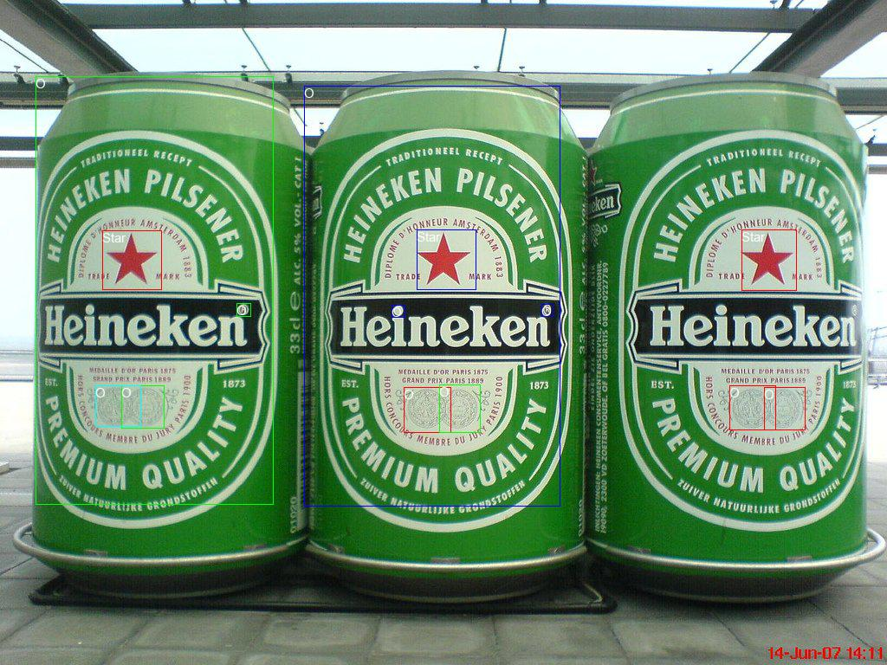
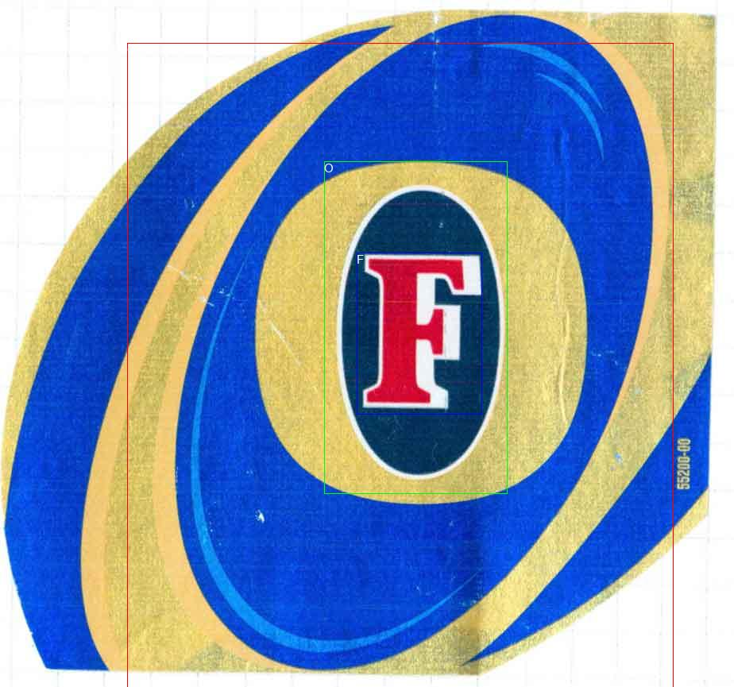

# Object Detection from Beer Dataset

This is an implementation of Mask RCNN on another dataset -Beer Dataset- using the code from https://github.com/matterport/Mask_RCNN
 
# Dataset
100 Beer Images collected from google to detect 3 objects - O (any circle or oval ), F letter and Star ★. 

the dataset is under dataset folder with subfolders train (90 images) and val (10 images)

# Training 
python3 './ofstar.py' train --dataset='./dataset/' --weights=coco   (to train using pretrained coco model)
or, 
python3 './ofstar.py' train --dataset='./dataset/' --weights=last   (to start train model form last saved model)

#saved model will be found in ./logs folder created while start training.

# Models pretrained on COCO and Beer Datasets 
you could downlaod from this link below and save to your present working directory.
https://drive.google.com/drive/folders/1hW0V-X3W083hcPlCodAcS4uyjskgAqh-?usp=sharing

# Data inspection and Model inference 
inspect_ofstar_data.ipynb notebook is provided for visulation of tthe dataset.
inspect_ofstar_model.ipynb to use the trained model to detect objects of validation dataset.

# Statistics and Results
On Train | O | F | Star ★ | Total  
--- | --- | --- | --- |--- 
Ground Truth | 942 | 160 | 177 | 1279 
Predictions | 678 | 110 | 157 | 945 
True Positive | 624 | 108 | 153 | 885 
Recall | 0.6624 | 0.6750 | 0.8644 | 0.6919
precision | 0.9204 | 0.9818 | 0.9745 | 0.9365 

mAP @ IoU=50: 76.02%,
Recall @ IoU=50: 69.19%,
Precision @ IoU=50 : 93.65%

On Validation | O | F | Star ★ | Total  
--- | --- | --- | --- |--- 
Ground Truth | 86 | 6 | 20 | 112 
Predictions | 54 | 4 | 11 | 69 
True Positive | 38 | 3 | 11 | 52 
Recall | 0.44 | 0.50 | 0.55 | 0.4643
precision | 0.70 | 0.75 | 1.00 | 0.7536 

mAP @ IoU= 50: 45.60%,
Recall @ IoU=50: 46.43%,
Precision @ IoU=50 : 75.36%,

using Mask R-CNN without Masks (Only Bounding Boxes), Results folder has a 3 samples from validation dataset.

 

